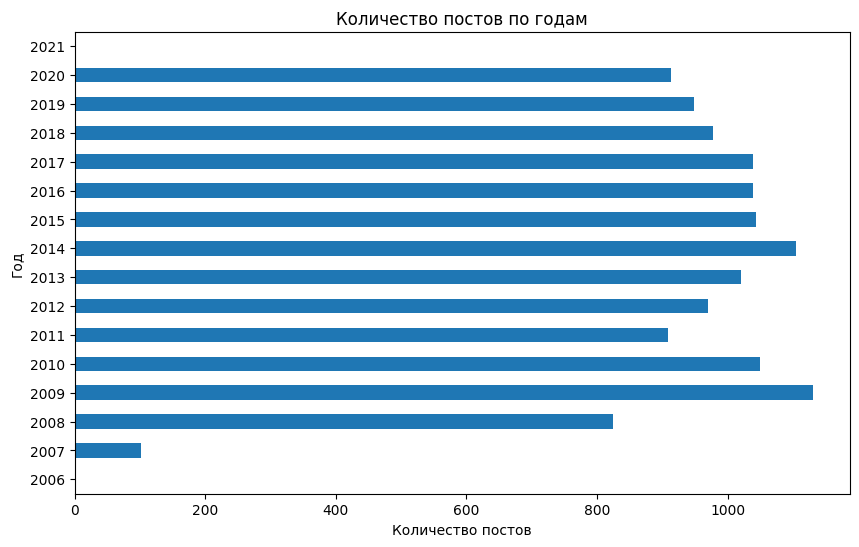

# Название проекта

## Обзор

Здесь мы скачаем данные с блога ЖЖ (LiveJournal) **Артемия Лебедева** и проведем анализ данных. В блоге 13000+ постов по годам с 2006 по 2021 г.г. Мы скачаем без комментариев.

 
 

## Структура директории

- **sitemap.xml**: XML файл, содержащий список URL-адресов и даты их последнего изменения, который может быть использован для веб-скрейпинга.

- **download/download.sh**: Wget скрипт для скачивания данных с сайта.

- **parse.ipynb**: Jupyter ноутбук для парсинга и очистки данных. Преобразует список постов в DataFrame Pandas, устанавливает индекс на дату и заменяет значения "N/A" на `NA` Pandas.

- **EDA.ipynb**: Jupyter ноутбук для разведочного анализа данных. Включает визуализации самых распространенных и самых редких категорий и тегов с использованием столбчатых и круговых диаграмм.

 

## Требования

- Python 3.12+
- Jupyter Notebook
- Pandas
- Matplotlib

## Использование

1. Откройте ноутбук `parse.ipynb` для парсинга и очистки данных.
2. Откройте ноутбук `EDA.ipynb` для проведения разведочного анализа данных и их визуализации.

## Лицензия

Весь контент блога Артемия Лебедева (https://tema.livejournal.com/) принадлежит ему и защищен его авторским правом. Здесь мы используем данные для обучения и демонстрации возможностей библиотек Python.

## Датасет

- **data/posts.parquet**: (11 MB) Датасет с данными о постах. Легко открывается в Pandas и используется для анализа.

- https://disk.yandex.ru/d/TJx6iU4k0TIa4A: (2.5 GB) zip-архив с сырыми html файлами постов. После распаковки размер файла составит 10.6 GB.

